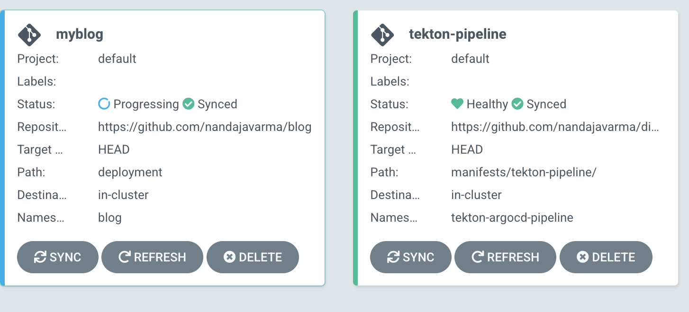

# GitOps pipeline using ArgoCD and Tekton 🌵

This is a demo of a kubernetes-native build/deploy pipeline using `Ambassador`,
`tekton` and `argocd`. The architecture of this pipeline is based of [this
blogpost](https://medium.com/dzerolabs/using-tekton-and-argocd-to-set-up-a-kubernetes-native-build-release-pipeline-cf4f4d9972b0).

For the purpose of demonstration, the workload I will be automating deployment
of, is [my personal blog](https://github.com/nandajavarma/blog). The repo of the
blog already has the kubernetes configurations necessary to deploy it in the
`deployment` directory.

A gist of how the pipeline would work is as follows:

- we have an API gateway setup for our cluster with ambassador.
- we have argocd and tekton setup in the cluster.
- we will have written tekton pipeline to automate build and deploy of an app.
- argocd will have two active `Applications`, one for the blog itself and
  another for the tekton pipeline that we just wrote.
- When someone push a change to the `main` branch of `blog`, a webhook is called
  from `github` to `tekton`, that trigger the pipeline and it build the `docker` image and push
  it to a registry using `kaniko`
- The `blog` Application on argo is synced to use the latest updates

> 🚧  We will only use one k8s cluster for the deployment of argocd and that of the
> workload(blog). I'm sure you already know it, but this is not a great real
> life practice.

## ✨ Setup the Kubernetes cluster

We use terraform to setup a Kubernetes cluster on digital ocean. The
configuration needed to setup the cluster using terraform on DigitalOcean are
present in the [`terraform`](./terraform) directory. Please refer the
[`README`](./terraform/README.md) to setup a cluster using this configuration.
Once you have setup the cluster, move on to the next step to setup the
infrastructure for the pipeline.

## 🏗️ Install and setup ambassador, tekton and argocd

The configurations and steps to be followed to setup the infrastructure pipeline
can be found in the [`deployment`](./deployment) directory. Move on to the
[`README`](./deployment/README.md) there to complete the setup before moving forward.

## ㊙️ Create namespace and secrets for the pipeline

We are almost ready to get started with the pipeline code. We just are in short
of creating a namespace for the pipeline resources. We will also create secrets in the
same namespace that would give access to resources in that namespace to docker
regusernameistry we use, argocd installation and github.

The configuration for this is already bundled inside
[`manifests/config`](./manifests/config), but before we apply this, we have to
create env files used by this config as follows:

1. Docker registry secrets

    For the purpose of this demonstration, I will be using the container registry on
    digitalocean. We will use this to push the image built by tekton using kaniko. To give
    tekton to push, we first have to create a kubernetes secret with `username` and
    `password` both corresponding to Digitalocean registry.

    Go  to `Container Registry` on the navbar of DigitalOcean, go with the `Free`
    plan for this demo, Create a private container registry to add your images
    to.
    Once the registry is created, to access it, you can create a simple Digital
    Ocean `API` token(say `$DIGITAL_OCEAN_TOKEN`). Try logging in to registry using
    it:

    ``` sh
    $ docker loging -u $DIGITAL_OCEAN_TOKEN -p $DIGITAL_OCEAN_TOKEN registry.digitalocean.com
    Login Succeeded
    ```

    To create a secret from this, first create a file
    `manifests/config/git_app_secrets.env` with following data:

    ``` sh
    $ cat manifests/config/git_app_secrets.env
    username=<put your do token here>
    password=<put your do token here>
    ```

1. ArgoCD user credentials

    We have to let pipelines to access argoCD. You should already have username and
    password of argocd from the installation step. give the details in the file
    `./manifests/config/argocd_secrets.env` as follows:

    ``` sh
    $ cat ./manifests/config/argocd_secrets.env
    ARGOCD_USERNAME=admin
    ARGOCD_PASSWORD=banana
    ```

1. Github user credentials

    In case our repository is private, it is important to give the pipeline access
    to that. Create a personal access token on github. Add the following to the file
    `./manifests/config/git_app_secrets.env`:

    ``` sh
    $ cat ./manifests/config/git_app_secrets.env
    username=nandajavarma
    password=ghp_blahblahblahblah
    ```

Once we have all of the above set, it is time to create namespace and the
secrets under it, you can do that by running the command:

``` sh
$ kustomize build ./manifests/config/  | kubectl apply -f-
namespace/tekton-argocd-pipeline created
secret/argocd-env-secret created
secret/basic-docker-user-pass created
secret/basic-git-app-repo-user-pass created
```

## 🧪 Create tekton reources, triggers, tasks and pipeline

> 🚧 I recommend understanding the [core
> concepts](https://tekton.dev/docs/concepts/) of tekton
> for this section

The next step is to configure tekton to automatically build and deploy the blog
application. Like mentioned previously, we make our tekton pipeline a argocd
`Application`, which will get triggered on a change to the github code of the
`blog` and in turn updates the `blog` application.

For convenience, we will use this repo as the `tekton-pipeline` application. The
entire code for the pipeline is present in the directory
[`tekton-pipeline`](./manifests/tekton-pipeline/). We have a bunch of important
parts in this directory:

- Tasks: A task is a step that you would like to execute in the process of
  CI/CD. For example building the docker image is a task.
- Triggers: Triggers like the name suggest provides an eventlistener to trigger
  a pipeline. It also provide templates for other pipeline related resources.
- Pipelines: A collection of tasks
- `resources` directory: This resource contains a bunch of role bindings and
  configmap we need for the working of this pipeline including binding to service
  account that give access to registry secret and github secret.

You can read the files for a deeper understanding of what they are doing.
Explaining each of them in depth is out of the scope of this write-up.

For argocd to deploy the `tekton-pipeline` application, we also need a
`kustomization.yml` file in the base of the path. You can find that
[`here`](./manifests/tekton-pipeline/kustomization.yml).

## 🔭 Add repos to argocd

> 🚧 I recommend understanding the [core
> concepts](https://argo-cd.readthedocs.io/en/stable/core_concepts/) of argoCD
> for this section

For this demo, I will be using my [personal
blog](https://github.com/nandajavarma/blog) to be continuously deployed using
the tekton pipeline in this repo. My personal project already has the
`kustomization.yml` file and corresponding resources in the deployment
directory. For argoCD to identify this repo, we first have to create an
argocd `Application` corresponding the repo and the path to `kustomization.yml`
file. You can find this definition in
[argocd_blog_app.yml](./manifests/argo/argocd_blog_app.yml).

Similarly, to deploy our tekton pipeline in this repo, we have to create a
`argocd` `Application` corresponding to this repo as well. You can see the
definition for that in
[argocd_tekton_pipeline_app.yml](manifests/argo/argocd_tekton_pipeline_app.yml).

We will now create these two applications in the cluster, by running the
command:

``` sh
❯ kustomize build ./manifests/argo | kubectl apply -f-
application.argoproj.io/myblog created
application.argoproj.io/tekton-pipeline created
```

You can check the argocd UI and you will see both the Applications. You can go
ahead and sync both the applications.



You will see that the tekton-pipeline application works fine, whereas the
`myblog` application is in `unhealthy` state. This is because the docker image
is not in the registry yet. Worry not, it will get there in the next step

If you try to look at the pods in namespace `blog`, you can verify this:

``` sh
$ kubectl get pods -n blog
NAME                      READY   STATUS             RESTARTS   AGE
myblog-7f9fb84d98-4wf79   0/1     ImagePullBackOff   0          52s
```

## Configure a webhook from github to the tekton trigger

From the trigger file
[`build-deploy-trigger.yml`](./manifests/tekton-pipeline/triggers/build-deploy-trigger.yml),
you can see that we have created an ambassador mapping, that will map the prefix
`/tekton-argocd-blog-build-mapping/` of the ambassador endpoint to the
`tekton-argocd-blog-build-el` Service which is practically the event listener
of tekton. All we need to do is to configure `Github` repo of blog to send a
`GET` request with JSON payload on all `push` events to the master branch of
repo. You can find the option to do this in `Settings -> Webhooks` of the repo.
The URL to send webhook to would be
`cluster.nandaja.space/tekton-argocd-blog-build-mapping/` in my case.

## 🧨 See the magic in action

Time to see what tekton can do! Make a small change in the app repo(in my case,
my blog) and push it to github.

In a couple of minutes, if you look at the pods in namespace
`tekton-argocd-pipeline`, you will see the following activity:

``` sh
$ kubectl get pods -n tekton-argocd-pipeline
NAME                                                              READY   STATUS            RESTARTS   AGE
el-tekton-argocd-blog-build-el-dfb7ff5dc-d2tlk                    1/1     Running           0          17m
tekton-argoc8b39edc3cec8ab9c412f39ab4d6afdddb9c6fe136e6fdb9-pod   0/4     Completed         0          113s
tekton-argocd-8b39edc3cec8ac6405ca20941cf43835268c8ae616f95-pod   0/1     PodInitializing   0          20s
```

Wait for the third pod to complete as well. Basically the job that just
completed has pushed the docker image to the corresponding registry and the
third one now is syncing the argocd application corresponding to `myblog`. In a
few minutes if you check the pod of the blog, you will see:

``` sh
$ kubectl get pods -n blog
NAME                      READY   STATUS    RESTARTS   AGE
myblog-7f9fb84d98-xsszv   1/1     Running   0          3m26s
```

You will find the most up-to-date version of the blog at [`myblog.nandaja.space`](https://myblog.nandaja.space)
as configured with the `service` annotation of the blog.

That's it! Our pipeline setup is complete!
