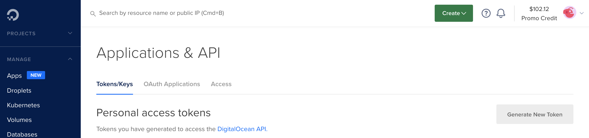
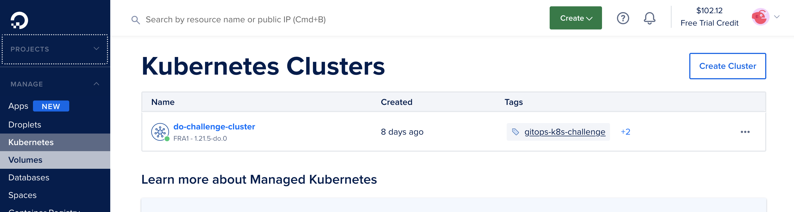

# Create a Kuberenetes cluster on DigitalOcean with terraform

## Requirements

* A digitalocean account
* `terraform` version `1.1.0`

## Authorization

For terraform provider  `digitalocean` to get authorized to our account, it will
look for an environment variable by the name `DIGITALOCEAN_TOKEN`. To get this
token, you can go to the `API` section of navbar on digitalocean and click on
`Generate New Token`.



Fill in a name and you will get a hash. Export that as
follows:

``` sh
export DIGITALOCEAN_TOKEN=abcfksjfjsfcfsdkfdsjfkdsjfkdjfdkfj
```

You can now process with the following steps.

## Setup of the backend

Without going into further details, what we are trying to do here is using
digitalocean spaces as backend for the state store of terraform. Initialisation
can be found in [`main.tf`](./main.tf) as follows:

``` json
# Remote state
terraform {
  backend "s3" {
    endpoint = "fra1.digitaloceanspaces.com"
    region   = "eu-central-1"
    key      = "terraform.tfstate"
    bucket   = "k8s-spaces"

    skip_credentials_validation = true
    skip_metadata_api_check     = true
  }
}
```

The thing is, this block is originally intended for `aws s3`, but we are using
the same to instead work with `digitalocean spaces`. To make the above code to
work, we have to do the following:

1. Create a space in digital ocean: I used the UI for this. I created a space in
   `Frankfurt` region with name `k8s-spaces`. It will give you an endpoint to
   connect to in the resulting window. Mine was `fra1.digitaloceanspaces.com`
   which I have used in the above config.
2. Get the spaces access keys: Go to the `API` section in the navbar on
   `digitalocean` console, where you will see a section `Spaces access keys`.
   Click on `Generate New Key`, fill in a name and you will get an `id`
   and an `secret`. Export both as environment variables as follows:

   ```sh
   export AWS_ACCESS_KEY_ID=<access id from digitalocean>
   export AWS_SECRET_ACCESS_KEY=<secret from digitalocean>
   ```

   Note that we are using env vars for `AWS` only because we are reusing the
   same `s3` block to connect to spaces.

## Config to setup the cluster

All the configuration necessary to create a cluster are given in this directory.
The most interesting part for us, in the cluster creating bit which can be seen
in the file [`kubernetes.tf`](./kuberentes.tf) as follows:

``` json
# Deploy the actual Kubernetes cluster
resource "digitalocean_kubernetes_cluster" "kubernetes_cluster" {
  name    = "do-challenge-cluster"
  region  = "fra1"
  version = "1.21.5-do.0"

  tags = ["gitops-k8s-challenge"]

  node_pool {
    name       = "nodepool-k8s-challenge"
    size       = "s-2vcpu-2gb"
    auto_scale = true
    min_nodes  = 1
    max_nodes  = 4
    tags       = ["default-node-pool"]
    labels = {
      "app"      = "gitops"
      "priority" = "high"
    }
  }
}
```

The above configure will create a cluster with kubernetes runtime version `1.21.5`.

We have a configuration written that uses terraform provider for digitalocean,
to create a cluster in the region `fra1` with autoscaling nodes(that range in
number between 1 and 4), of type `s-2vcpu-2gb`.

In the `kuberentes.tf`, you can also
see that, we try to get an `ouput` from the operation, which is the `kubeconfig`
data, which is the configuration we need to connect to the cluster.

## Creating the cluster

Now that all the setup are done, we can go ahead and create the cluster, just
run the following make target to initialize the backend and create the cluster:

``` sh
$ make create-cluster
```

The above step may take a few minutes to complete. If everything went as
planned, you can now go ahead get the `kubeconfig` to connect to the cluster, as
follows:

``` sh
$ make get-kubeconfig
```

The kubeconfig should now be present in `secrets/kubeconfig`, edit it to remove
the `EOF` lines.

Now you can connect to the cluster by:

``` sh
$ export KUBECONFIG=$(pwd)/secrets/kubeconfig
$ kubectl get pods -A
NAMESPACE     NAME                               READY   STATUS    RESTARTS   AGE
kube-system   cilium-operator-5f65c47d7d-t2nd4   1/1     Running   0          9m51s
kube-system   cilium-wskzs                       1/1     Running   0          7m15s
kube-system   coredns-85d9ccbb46-tjpkl           1/1     Running   0          9m50s
kube-system   coredns-85d9ccbb46-z4pz5           1/1     Running   0          9m50s
kube-system   csi-do-node-sc97h                  2/2     Running   0          7m15s
kube-system   do-node-agent-lx9t6                1/1     Running   0          7m15s
kube-system   kube-proxy-85p9j                   1/1     Running   0          7m15s
```

All is good! You should be able to see the running cluster on the
digitalocean UI as follows:


